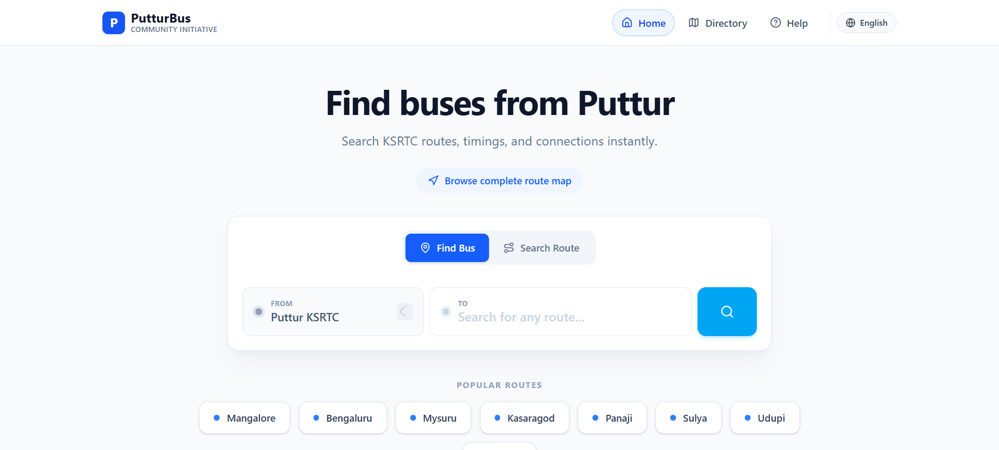
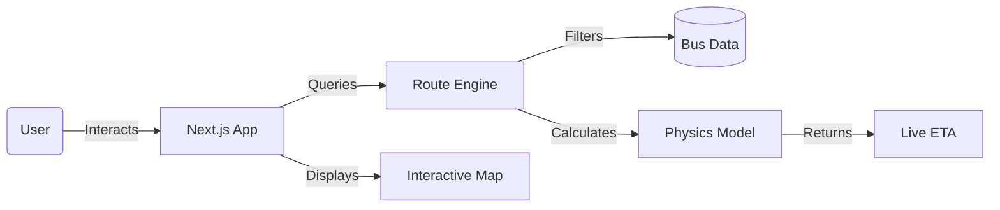

# 🚌 PutturBus - Real-Time KSRTC Transit App

**PutturBus** is a modern, high-performance transit application built for the KSRTC Puttur division. It transforms static bus schedules into a live, interactive, and reliable travel companion.

> [!IMPORTANT]
> **Community Project**: This is a non-commercial student initiative. Not affiliated with KSRTC. [Read Disclaimer](docs/USER_GUIDE.md#legal)

---

## 📚 Documentation Center

We have detailed documentation for every aspect of the project. Choose your path:

| 📘 **For Users** | 🛠️ **For Developers** |
| :--- | :--- |
| **[User Guide](docs/USER_GUIDE.md)** Learn how to search, track, and plan your journey. | **[Developer Guide](docs/DEVELOPER_GUIDE.md)** Setup, installation, and contribution guidelines. |
| **[Features Deep Dive](docs/FEATURES.md)** Understand the magic behind our Real-Time Engine. | **[Architecture](docs/ARCHITECTURE.md)** System diagrams, data flow, and tech stack details. |

---

## 🚀 Quick Start

Get the app running locally in 3 simple steps:

1.  **Clone**: `git clone https://github.com/Rajath2005/PutturBus.git`
2.  **Install**: `npm install`
3.  **Run**: `npm run dev`

Open [http://localhost:3000](http://localhost:3000) to see it in action.

---

## 🧩 System Overview

PutturBus is built on a modern stack designed for speed and reliability.

## 🌟 Key Features at a Glance

*   **⚡ Real-Time**: Status updates based on actual time (e.g., "Departing in 5 min").
*   **🍎 Physics-Based**: Travel times calculated using vehicle speed profiles (Ordinary vs Express).
*   **📍 Live Map**: True-shape route visualization on interactive maps.
*   **🗣️ Bilingual**: Native support for **Kannada** and **English**.

---

## 🤝 Contributing

We welcome contributions! Please read our [Developer Guide](docs/DEVELOPER_GUIDE.md) to get started.

---

*Built with ❤️ for KSRTC Puttur*